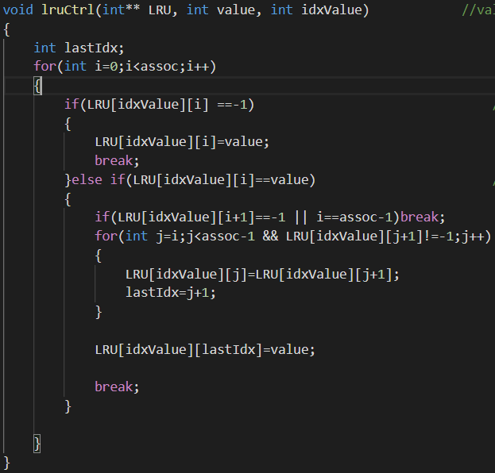
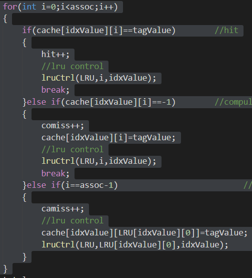
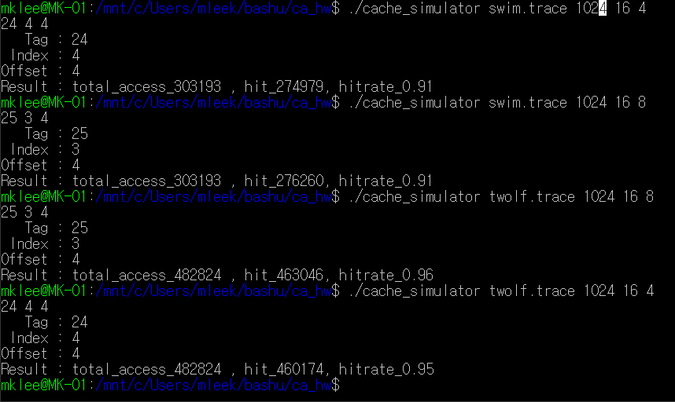

이명규(201716422)

전북대학교 컴퓨터공학부 2학년

이명규 lee95292@naver.com

# 요   약
---

N-way set associative Cache의 동작을 따라하는 Simulator를 C언어로 구현하였습니다. LRU를 비롯하여, Trace파일의 메모리 주소를 읽어 T/I/O 로 구분하고, 접근한 데이터를 2차원배열로 저장해줍니다. 이를 통해 Cache hit, Cache miss, Hit rate를 판별해주는 프로그램을 작성했습니다.

## 실행환경

---

컴파일 쉘 스크립트: gcc -o cache_simulator cache_simulator.c -lm

( Math 라이브러리를 사용하므로, lm 옵션을 통해 추가해주어야 합니다.)

우분투 Bash 쉘에서 실행하였으며, gcc 역시 우분투 초기버전 (gcc 5.4.0) 컴파일러에서 실행했습니다.

 <br>
 
### 1.  실습 프로그램의 구성 및 동작 원리

1)	에러처리
프로그램 실행 시작과 동시에 인자 값들을 읽어, 과제 개요에 설명된 예외들에 대해, 예외정보를 출력하고, 프로그램을 종료해줍니다. 

아래 그림은 존재하지 않는 파일에 대한 예외입니다.


2)	캐시공간 구성
캐시에 저장될 데이터와 LRU연산을 위한 배열들을 TIO 결정된 TIO 값들을 참고하여, 가상 캐시의 공간을 결정합니다. 

아래와 같이 2차원배열을 동적으로 구성하였습니다.

```c
cache[set(indx)][slots]   <= tag value

if cache[set][slots] == -1              
means: invalid slot 

LRU[set][slot]  LRU[set][0] 
means : LRU value correspond to set
```

__LRU와 가상Cache의 역할을 설명하는 코드 __ 

<br><br>


```c
int** cache= (int**)malloc(sizeof(int*)*(int)pow(2,indx));
int** LRU=(int**)malloc(sizeof(int*)*pow(2,indx));
memset(cache,0,sizeof(cache));
memset(LRU,0,sizeof(LRU));

for(int i=0;i<(int)pow(2,indx);i++)
{
cache[i]=(int*)malloc(sizeof(int)*assoc);
LRU[i] = (int*)malloc(sizeof(int)*assoc);
memset(cache[i],-1,sizeof(int)*assoc);
memset(LRU[i],-1,sizeof(int)*assoc); 
}
```
 
 __ LRU와 가상Cache 할당부분 __

캐시와 LRU를 구현함에 있어, 이들은 Tag, Index, Associativity에 따라 항상 다른 크기를 가집니다. 따라서 동적으로 크기를 할당해주어 원하는 만큼의 공간만을 사용합니다.

위 값들은 생성됨과 동시에, memset 함수를 통해 초기화 시켜줍니다. 


<br><br><br>

3)	LRU 구현

 
__ LRU 구현 코드 __
Input : 
LRU 2차원 배열 / 접근 Block Index / Set Index 값

Output : (void)
<br><br>

가장 나중에 사용된 블록을 LRU 배열의 가장 앞에 위치시킵니다.


블록에 접근할 때 마다, 해당 블록의 인덱스를 맨 뒤로 정렬시켜, LRU가 가장 앞에 위치하게 됩니다.


<br><br><br>

4)	Hit , Miss 판별

 
__ HIT / MISS 판별 코드 __

메인 알고리즘인 Hit, miss 판별은 매우 간단합니다.
 
앞서 구현한 Cache 2차원배열의 초깃값을 고려해, Valid 여부를 판별해주어

_0 : Hit 한 경우 :현재 Block 인덱스를 가장 최근 사용된 블록으로 갱신해주고, 값을 넣습니다.

_1 : Compulsory Miss인 경우, 현재 Block 인덱스를 가장 최근 사용된 블록으로 갱신해주고 값을 캐시에 넣습니다.

_2 : Capacity Miss인 경우 : LRU를 가장 최근에 사용된 블록으로 갱신해주고, 캐시의 현재 Block Index에 값을. 넣어줍니다.


<br><br><br>


2. 결과
 

__결과화면 __

주어진 두 개의 트레이스 파일들에 대해 실행시킨 결과 화면입니다.

<br><br>

대체적으로 Associativity가 증가할수록 HitRate가 증가하는 경향을 보이며, 

수업시간에 배운 방식대로 T I O가 결정되는 모습을 확인할 수 있습니다.

<br><br><br>
3. 결론

LRU 구현에 있어, 관련 발상을 하는 것에 많은 시간소비와 시행착오가 있었습니다.

또한 배열의 경계 부분에서 값을 변경하거나 할 때, 세부적인 오류를 찾아내는 방법으로 테스트 코드 작성을 적극적으로 활용하였고, 

주석을 통한 Documentation을 통해 알아보기 쉬운 코드를 작성하였습니다.
